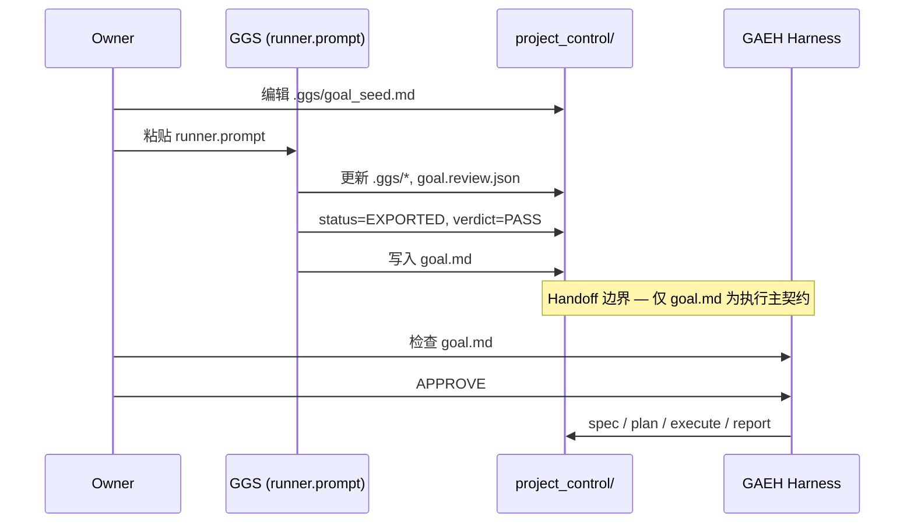

# GGS → GAEH Handoff Contract

| 元数据 | 值 |
|--------|-----|
| 契约版本 | `handoff_schema_version: 1.0` |
| 生产者 | GGS（Goal Generation System） |
| 消费者 | GAEH（Goal-Driven AI Engineering Harness） |
| 消费者最低版本 | GAEH Kit **v0.3.0** |
| 关联 | [GGS_Overview.md](./GGS_Overview.md) |

---

## 1. 契约目的

固定 **GGS 何时算完成**、**GAEH 何时可以开始执行**，避免：

- 目标未评审就写代码；
- GAEH 误读 `.ggs/` 中间态为真相源；
- GGS 与 GAEH 在同一对话里混跑（边界失控）。

---

## 2. 唯一主交接产物

GAEH **只将以下文件视为执行输入的最高优先级契约**：

```text
project_control/goal.md
```

路径由 GGS `state.json` 配置：

```json
"export": {
  "target_goal_path": "project_control/goal.md"
}
```

`goal.md` 章节结构须满足 `project_control/.ggs/templates/goal.schema.md` 中的 **Hard Gates**（见第 4 节）。

---

## 3. GGS Export 完成条件（三件套）

在宣布「GGS 完成、可交给 GAEH」之前，**必须同时满足**：

| # | 检查项 | 条件 |
|---|--------|------|
| 1 | 状态机 | `project_control/.ggs/state.json` → `"status": "EXPORTED"` |
| 2 | 结构化评审 | `project_control/.ggs/goal.review.json` → `"verdict": "PASS"` |
| 3 | 主契约 | `project_control/goal.md` 存在，且通过 Hard Gates（第 4 节） |

### 3.1 人工快速检查（PowerShell 示例）

```powershell
$root = "D:\path\to\your-project"
$state = Get-Content "$root\project_control\.ggs\state.json" -Raw | ConvertFrom-Json
$review = Get-Content "$root\project_control\.ggs\goal.review.json" -Raw | ConvertFrom-Json

$state.status -eq "EXPORTED"
$review.verdict -eq "PASS"
Test-Path "$root\project_control\goal.md"
```

三项均为真 → 满足 GGS Export 三件套。

### 3.2 常见未通过情形

| 情形 | 处理 |
|------|------|
| `verdict` 为 `REVISE` | 继续 GGS 修订循环，**不要** `gaeh start` 连续实现 |
| `verdict` 为 `BLOCKED` | 回答 `open_questions` 或确认 Best-Effort 假设 |
| 有 `goal.draft.md` 但无 `goal.md` | Export 未完成 |
| `status` 非 `EXPORTED` | 继续跑 GGS runner |

---

## 4. `goal.md` 质量门槛（Hard Gates）

与 `goal.schema.md` 一致，Export 时至少满足：

1. **Target Outcome**：交付物明确（代码 / 功能 / 可运行程序 / 文档等）。
2. **Success Criteria**：至少 3 条，且至少 1 条可验证（命令或可观察行为）。
3. **Scope**：含 In Scope / Out of Scope。
4. **Constraints**：技术栈或平台有说明或假设（未知则见 `assumptions.md`）。
5. **Inputs**：从零或基于现有仓库有说明。
6. **Output Format**：至少 1 个具体产物（文件 / 模块 / 接口）。
7. **Risks**：至少 1 条不确定点或明确「无明显风险」。

---

## 5. 辅助产物（非 GAEH 必读）

| 文件 | 角色 | GAEH v0.3 是否机读 |
|------|------|-------------------|
| `project_control/goal.next.md` | Export 缓冲，应用前草稿 | 否 |
| `project_control/.ggs/goal.review.json` | 评审 + `handoff` 建议 | **否**（可选人工/AI 参考） |
| `project_control/.ggs/assumptions.md` | Best-Effort 假设审计 | 否（harness 可引用） |
| `project_control/.ggs/goal.draft.md` | 过程稿 | 否 |
| `project_control/.ggs/history/*` | 迭代快照 | 否 |

### 5.1 `goal.review.json` 中的 `handoff`（建议性）

Export 时 `handoff` 应包含：

- `recommended_route`：如 `tiny_fix` / `spec_first` / `architecture` / `phase`
- `seed_tasks[]`：建议的首批任务描述
- `spec_outline[]`、`verification_plan[]`

**GAEH 不得**因 `handoff` 缺失而拒绝执行；**GAEH 不得**将 `handoff` 当作已批准的 `task_queue`。

---

## 6. GAEH 启动条件（Export 之后）

满足第 3 节三件套后，GAEH 执行还需：

| # | 条件 | 说明 |
|---|------|------|
| A | `goal.md` 可读 | Owner 或 AI 以之为最高优先级输入 |
| B | Owner 明确同意连续实现 | 对话 `APPROVE` 或 `approval.json` 中 `start_execution` → `APPROVED` |
| C | 项目骨架完整 | `gaeh doctor` 对 GAEH 核心项 PASS |

### 6.1 GAEH 对 `.ggs/` 的约定

- **不解析** `.ggs/` 作为执行真相源。
- **不依赖** `goal.review.json` 做路由或门禁。
- 执行期假设问题可查 `assumptions.md` 或 `decision_log.md`。

### 6.2 推荐命令与对话顺序

```text
1. gaeh ggs          （可选，打印 GGS 入口）
2. [Codex/Cursor] 跑 GGS runner → 三件套满足
3. gaeh doctor       （确认 GAEH 骨架）
4. [Codex/Cursor] gaeh start / 按 GAEH 流程
5. Owner: APPROVE
6. GAEH 连续实现 → plans / reports / reviews
```

---

## 7. 端到端 Handoff 流程图



---

## 8. 手写 `goal.md` 与 GGS Export 的关系

| 来源 | 是否有效 Handoff |
|------|------------------|
| GGS Export（三件套齐全） | 是（推荐） |
| Owner 手写 `goal.md`，未跑 GGS | 是（GAEH 允许），但无 `goal.review.json` 审计 |
| 仅有 `goal.draft.md` | 否 |

若跳过 GGS：Owner 须自行保证 `goal.md` 满足 Hard Gates；GAEH 仍要求 `APPROVE`。

---

## 9. 变更与回滚

| 事件 | 动作 |
|------|------|
| Export 后 Owner 改目标 | 更新 `goal.md` 或重跑 GGS；重大变更写入 `change_requests.md`，**再次** `APPROVE` |
| 发现假设错误 | 更新 `assumptions.md` / `goal.md`；必要时重跑 GGS |
| 回滚到上一版目标 | 使用 `.ggs/history/<iteration>/` 快照恢复 |

---

## 10. 契约变更策略

| 版本 | 变更范围 |
|------|----------|
| 1.0（当前） | 三件套 + `goal.md` Hard Gates；GAEH 不读 review |
| 未来 1.1+ | 可增加 `handoff.json`、GAEH doctor 可选 WARN 等；须写迁移说明 |

破坏性变更（如 `goal.md` 换路径）需 **GAEH minor+** 与 **GGS** 同步发版，不在 v0.3.0 冻结线内修改。

---

## 11. 检查清单（打印用）

**GGS 完成**

- [ ] `state.json` → `EXPORTED`
- [ ] `goal.review.json` → `verdict: PASS`
- [ ] `goal.md` 满足 Hard Gates
- [ ] 假设已记入 `assumptions.md`（如有）

**可启动 GAEH**

- [ ] `gaeh doctor` PASS（核心项）
- [ ] Owner 已理解 `goal.md`
- [ ] 已准备 `APPROVE`（尚未同意前不得连续改代码）
